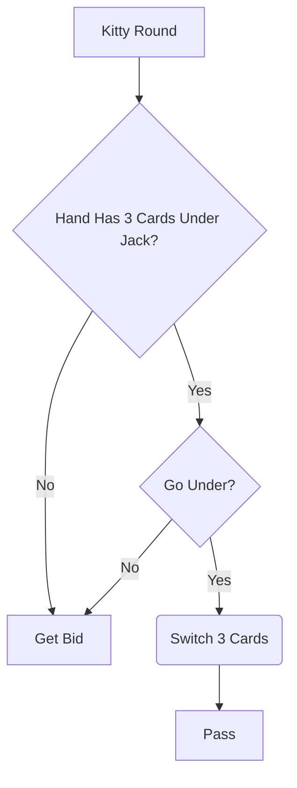

# Implementation

This document outlines a high level design of the implementation of the "Go Under" feature.  See the Feature Description document [Feature Desciption.md](Feature Description.md) for an explanation of the feature, and the User Story document [User Story.md](User Story.md) for the explanation from a user's perspective.

# Flowchart

