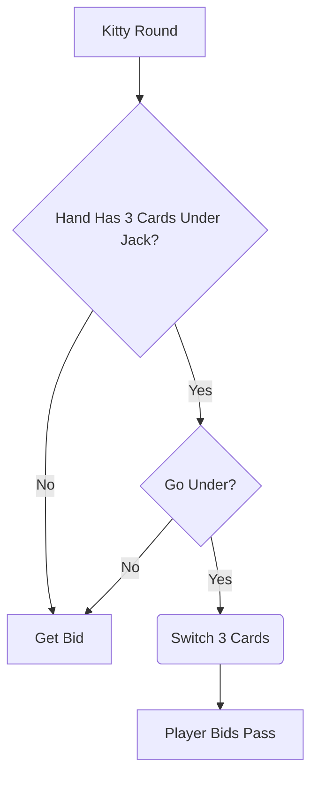

# Implementation

This document outlines a high level design of the implementation of the "Go Under" feature.  See the Feature Description document [Feature Desciption.md](Feature Description.md) for an explanation of the feature, and the User Story document [User Story.md](User Story.md) for the explanation from a user's perspective.

# Flowchart

# What Needs To Be Changed

1. New setting to enable/disable the feature.
   1. An update to the settings form to allow the user to adjust the setting.
2. Flow of bidding process to check for the possibility of using the Go Under feature, if enabled, in each player's hand during the Kitty Round of bidding.
3. Implementation of the feature in the bidding round when the player wants to use the feature.
4. The logic of the bidding process for the automated players to determine if they want to use the feature.
   1. The logic should choose not to use the feature if the automated player wants to order up the kitty card and to use the feature if the player does not want to order up the kitty card.
5. A message should be added to the main window during the bidding process to indicate when a player uses the "Go Under" feature.

# What Needs To Be Added

1. A new form to prompt the application user to indicate if they want to "Go Under".
2. A new form to prompt the application user to select 3 cards to exchange if they have more than 3 cards below the rank of Jack in their hand.
3. Code to let the application know the player used the "Go Under" feature including which cards they wanted replaced and which cards were added to their hands.
4. 